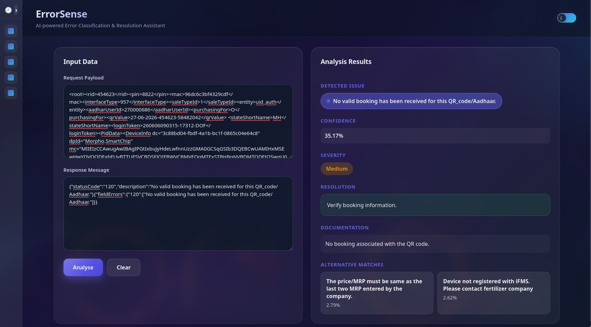

# ErrorSense

Machine Learning based API Error Classification and Resolution Assistant

ErrorSense is a ML-powered diagnostic tool that classifies API and server failures from request and response into definitive categories. It provides insightful details like severity level, contextual resolutions, next steps and brief documentations. It combines NLP-based classification with a rule-driven knowledge base to assist developers and support teams in identifying common operational errors.

## Features

- Classifies API failures into predefined categories
- Supports both JSON and XML request formats
- Parses response payloads to extract structured features
- Returns confidence scores and alternative predictions
- Provides resolutions, possible causes and prevention tips
- Search history with a clean web interface



## Dataset

The model was trained on a dataset containing approximately 8,000 API transaction records collected from a real-world enterprise environment.

Each record consists of:

- Request payload
- Response payload
- Error description (target label)

The dataset contains both XML and JSON formatted requests and responses representing authentication failures, timeout issues, validation errors, device registration problems, transaction failures, OTP failures, dealer-related issues, and several other operational scenarios.

After preprocessing and normalization, the dataset contains:

- **7,991 records**
- **58 normalized error categories**

Normalizing semantically identical descriptions significantly reduced label fragmentation and improved overall classification performance.

## Feature Engineering

The primary improvement in model performance came from feature engineering rather than replacing the classifier.

### Request Parsing

Instead of using raw request payloads directly, the application extracts structured information such as:

- Request format (JSON/XML)
- Entity name
- Interface type
- API version
- State information
- Important request flags

Encrypted values, authentication tokens, certificates, hashes, transaction identifiers, and other high-cardinality fields are intentionally discarded since they introduce noise without improving prediction quality.

### Response Parsing

The response payload is parsed to extract structured information including:

- Status code
- Response description
- Response format

These structured features provide strong indicators for many error categories while remaining generalizable across requests.

### Description Normalization

Several error descriptions contained dynamic values such as Aadhaar suffixes, timestamps, product names, plant identifiers, and numeric values.

These variable portions were normalized using regular expressions to merge semantically identical errors into common categories.

Example:

Before

PLEASE REGISTER WITH PRIMARY AADHAAR XXXXXXXX1234

After

PLEASE REGISTER WITH PRIMARY AADHAAR XXXXXXXX

This preprocessing reduced label fragmentation from **147** categories to **58** normalized categories, resulting in a significant improvement in classification performance.

## Model Selection

Multiple machine learning models were evaluated during development.

| Model                                    | Accuracy  |
| ---------------------------------------- | --------- |
| Logistic Regression (Baseline)           | 93.9%     |
| Linear SVM                               | 98.6%     |
| Logistic Regression (Feature Engineered) | **99.3%** |

Although Linear SVM achieved higher raw classification accuracy, it does not natively provide calibrated probability estimates required by the application for confidence scores and alternative predictions.

Since prediction confidence is an important part of the user interface and API responses, Logistic Regression was selected as the production model after feature engineering.

This provided an excellent balance between prediction quality, interpretability, and probabilistic outputs.

## Knowledge Base

The machine learning model is complemented by a lightweight rule-based knowledge base.

For each predicted error category, the system returns:

- Resolution
- Possible cause
- Severity level
- Preventive recommendation

Separating operational knowledge from the classifier allows support documentation to evolve independently without retraining the model.

## Backend API

### GET /

Returns application status.

### POST /predict

Classifies an API failure and returns the predicted category, confidence score, possible resolution, severity, likely cause, preventive recommendation, and alternative predictions.

Example request:

```json
{
    "request": "...",
    "response": "..."
}
```

Example response:

```json
{
    "category": "...",
    "confidence": 99.42,
    "severity": "Medium",
    "resolution": "...",
    "cause": "...",
    "prevention": "...",
    "alternatives": []
}
```

### POST /debug

Returns the top prediction probabilities for debugging and model evaluation.

## Frontend

The frontend is built using React and provides an interface for interactive error analysis.

Features include:

- Request payload input
- Response payload input
- Prediction confidence
- Resolution suggestions
- Alternative predictions
- Theme switching
- Recent search history
- Responsive layout

## Results

| Metric            | Value      |
| ----------------- | ---------- |
| Dataset Size      | 7,991      |
| Final Categories  | 58         |
| Accuracy          | **99.31%** |
| Macro F1 Score    | 0.95       |
| Weighted F1 Score | 0.98       |

The largest performance improvement was achieved through structured feature extraction and description normalization rather than replacing the underlying classifier.

## Future Work

Possible future improvements include:

- Sentence Transformer embeddings for semantic similarity
- Hybrid rule-based and machine learning inference
- Confidence calibration using CalibratedClassifierCV
- Automated retraining pipeline
- Explainable AI techniques for prediction interpretation
- Incremental learning for newly observed error categories

## Lessons Learned

This project demonstrated that improving data quality and feature engineering can have a much greater impact than increasing model complexity.

Key observations during development included:

- Response payloads contain significantly more predictive information than request payloads alone.
- Parsing structured request metadata improves generalization compared to using raw payloads.
- Removing encrypted and high-cardinality fields reduces model noise.
- Description normalization substantially decreases label fragmentation.
- Careful preprocessing improved model accuracy more effectively than switching classifiers.
